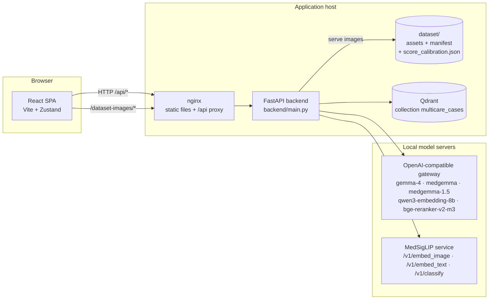
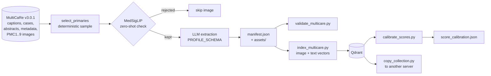
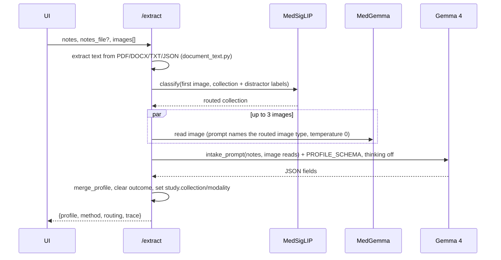
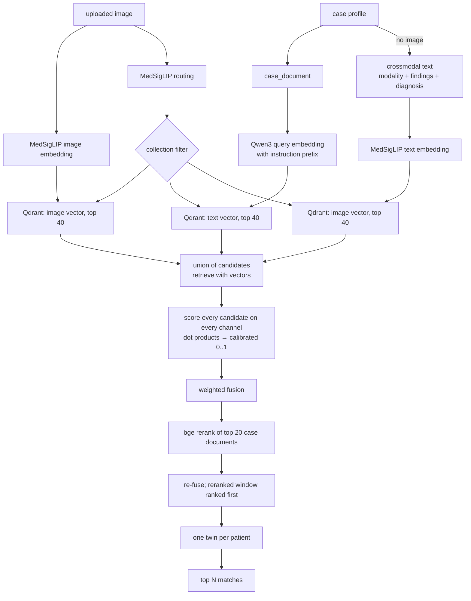

# CaseTwin architecture

This document describes how CaseTwin works end to end: the components, the AI
models and what each one does, the data contracts, the offline pipeline that
builds the twin library, every online request flow, the frontend, and the
reliability decisions behind them. It reflects the code on
`feature/local-ai-hybrid-twins`.

- [1. What the application does](#1-what-the-application-does)
- [2. System overview](#2-system-overview)
- [3. Deployment topology](#3-deployment-topology)
- [4. AI models and their roles](#4-ai-models-and-their-roles)
- [5. Data model](#5-data-model)
- [6. Offline pipeline: building the twin library](#6-offline-pipeline-building-the-twin-library)
- [7. Online request flows](#7-online-request-flows)
- [8. The AI trace contract](#8-the-ai-trace-contract)
- [9. Frontend architecture](#9-frontend-architecture)
- [10. Reliability and guardrails](#10-reliability-and-guardrails)
- [11. Configuration reference](#11-configuration-reference)
- [12. Repository map](#12-repository-map)
- [13. Testing](#13-testing)
- [14. Known limitations and extension points](#14-known-limitations-and-extension-points)

---

## 1. What the application does

1. **Intake.** A clinician pastes unstructured notes (or uploads a PDF/DOCX/TXT)
   and drops in images. The system builds a clean, structured case report.
2. **Twin search.** That report and image are matched against a library of
   published case reports (the "twins").
3. **Learn from the twin.** Each twin shows its findings, management, outcome
   and the authors' conclusion. The clinician can ask questions grounded in the
   twin and the current case, and have any medical term explained, including in
   simple Hindi or Marathi.

It is a teaching demo of medical AI, not a clinical tool. Every model call is
local, and every AI step is visible in the UI.

---

## 2. System overview



The backend is stateless: it holds no session data. Case state lives in the
browser; the twin library lives in Qdrant (vectors and profiles) and in
`dataset/` (images). The offline pipeline (section 6) builds both.

---

## 3. Deployment topology

| Mode | Frontend | Backend | Qdrant |
|---|---|---|---|
| Development | `npm run dev` → `http://localhost:5173`, calls `VITE_API_URL` (e.g. `http://localhost:8005`) | `uvicorn main:app --port 8005` from `backend/` | standalone container on `localhost:6333` |
| Docker Compose | nginx on `:8080`, built with `VITE_API_URL=/api` | container port 8000, published as `:8005` | `qdrant` service bound to `127.0.0.1:6333`, volume `qdrant_storage` |

In Compose, nginx (`nginx.conf`):
- serves the built SPA, falling back to `index.html`;
- proxies `/api/*` to `backend:8000/*` with the prefix stripped, so the browser
  only ever talks to its own origin;
- proxies `/dataset-images/*` to the backend, so image URLs built by FastAPI's
  `url_for` (which keep the browser's `Host`) stay same-origin.

The backend container mounts `./dataset` read-only at `/app/dataset`
(`DATASET_DIR`). Secrets come from `backend/.env` via `env_file` and are never
baked into images.

---

## 4. AI models and their roles

| Model | Served by | Used for | Called from |
|---|---|---|---|
| **MedSigLIP** (`google/medsiglip-448`) | dedicated service | Image embeddings (1152-d) for visual search; text embeddings in the same space for notes-only search; zero-shot labels to route an image to its collection and to clean the dataset | `local_ai.generate_embedding`, `medsiglip_text_embedding`, `medsiglip_classify` |
| **`medgemma`** (MedGemma 27B) | gateway | Reading uploaded images during intake; clinical synthesis; grounded twin chat; term explanations; image reads and comparison text for the (hidden) image comparison | `query_medgemma`, `query_text`, `query_medgemma_read` |
| **`gemma-4`** | gateway | Notes + image reads → structured case report under a JSON Schema; rewriting explanations in simple Hindi/Marathi; offline extraction of library cases | `extraction.extract_profile`, `/explain_selection` |
| **`medgemma-1.5`** (4B) | gateway | Chest X-ray finding bounding boxes (only in the hidden comparison feature) | `query_medgemma_localization` |
| **`qwen3-embedding-8b`** | gateway `/v1/embeddings` | Case-report embeddings (4096-d) for semantic search | `local_ai.text_embeddings` |
| **`bge-reranker-v2-m3`** | gateway `/v1/rerank` | Cross-encoder reranking of the top 20 candidate twins | `local_ai.rerank` |

All chat calls go through `local_ai.query_local_model`, which:
- sends text-only requests as a plain string (MedGemma answers text questions
  directly; no placeholder images are ever sent);
- attaches images as base64 PNG data URLs, resized to fit 768 px;
- optionally passes a JSON Schema (`response_format: json_schema`, enforced by
  llama.cpp as a grammar), conversation `history`, `temperature`, and
  `chat_template_kwargs.enable_thinking=false` to turn Gemma 4's reasoning off;
- can target another OpenAI-compatible server (`base_url`, `api_key`), which
  the offline pipeline uses.

Model names are configurable (section 11). Gemma 4 is a shared service:
interactive use makes one call per action, and batch jobs default to 2
concurrent requests.

---

## 5. Data model

### 5.1 The canonical case profile

One JSON shape is used everywhere: live intake, library cases, Qdrant
payloads, the API and the frontend. It is defined by
`backend/manifest.py::empty_profile` and mirrored by
`src/lib/caseProfileTypes.ts`.

| Section | Fields |
|---|---|
| identity | `profile_id`, `case_id`, `image_id` |
| `patient` | `age_years`, `sex`, `immunocompromised`, `weight_kg`, `comorbidities[]`, `medications[]`, `allergies` |
| `presentation` | `chief_complaint`, `symptom_duration`, `hpi`, `pmh` |
| `study` | `collection`, `modality`, `body_region`, `view_position`, `radiology_region`, `caption`, `image_type`, `image_subtype`, `image_url`, `storage_path` |
| `assessment` | `diagnosis_primary`, `suspected_primary[]`, `differential[]`, `urgency`, `infectious_concern`, `icu_candidate` |
| `findings` | `imaging_findings[]`, `lab_findings[]`, plus chest-specific `lungs`, `pleura`, `cardiomediastinal`, `devices` sub-objects (yes/no/null) |
| `management` | `treatments[]`, `procedures[]` |
| `summary` | `one_liner`, `key_points[]`, `red_flags[]`, `conclusion` |
| `outcome` | `success`, `detail`, `follow_up` |
| `provenance` | `dataset_name`, `pmc_id`, `pmid`, `doi`, `article_title`, `journal`, `year`, `authors[]`, `license`, `source_url` |
| `tags` | `ml_labels[]`, `gt_labels[]`, `keywords[]`, `mesh_terms[]` |
| `extra_fields` | open key-value map (e.g. `ai_image_read`) |

`normalize_profile` fills missing fields with defaults, coerces scalars into
lists where the schema expects lists, and keeps `extra_fields` open-ended.
`merge_profile` accepts only known fields from model output, so a model cannot
add keys to the contract.

### 5.2 The extraction schema

`backend/extraction.py::PROFILE_SCHEMA` is the JSON Schema given to the LLM. It
covers the clinical sections above (not identity, provenance or tags, which come
from the dataset). Enums constrain `sex`, `urgency` and the yes/no fields. The
same schema and rules (`_RULES`) structure both library articles
(`article_prompt`) and live notes (`intake_prompt`), so a query and its twins
are described in the same terms.

### 5.3 The case document

`manifest.case_document(profile)` turns a profile into the text that is
embedded and reranked: demographics, comorbidities, chief complaint, history,
imaging, imaging and lab findings, diagnosis, suspected diagnoses,
differential, one-liner and caption, capped at 2,400 characters. It
deliberately excludes outcome and management. A new patient has no outcome, so
matching must rely on presentation and findings only.

### 5.4 Manifest (`dataset/manifest.json`)

`schema_version: "multicare-cases/v2"`. One record per library image:

| Field | Meaning |
|---|---|
| `point_id` | deterministic UUIDv5 of `multicare:<patient>:<file_id>` (also the Qdrant point ID) |
| `article_id`, `patient_id`, `collection`, `source_file_id` | provenance |
| `primary_image` | asset id (`<sha256>.<ext>`), caption, licence, type, region, view, labels, size, checksum |
| `related_images[]` | up to 8 other images of the same patient |
| `profile` | the canonical profile |
| `raw_abstract`, `raw_narrative` | source text |
| `enrichment_status` | `complete` or `unavailable` |
| `extracted_by` | which model structured the case (internal; not exposed by the API) |
| `zero_shot` | MedSigLIP quality-check result |

`stats` records counts per collection, rejected images, skipped patients and
the sampling parameters, so a build can be validated and reproduced.

### 5.5 Qdrant collection (`multicare_cases`)

- **Named vectors:** `image` (1152-d, cosine) from MedSigLIP and `text` (4096-d,
  cosine) from Qwen3. All vectors are L2-normalised, so cosine is a dot product.
- **Payload:** `collection`, `profile`, `primary_asset_id`,
  `related_asset_ids`, `primary_image`, `related_images`, `raw_narrative`,
  `raw_abstract`, `enrichment_status`, `schema_version`.
- **Payload index:** `collection` (keyword), used to filter searches to one
  collection.

### 5.6 Dataset folder

```
dataset/
├── assets/                    content-addressed image copies (<sha256>.<ext>)
├── manifest.json              the library contract (5.4)
├── score_calibration.json     per-channel score ranges (6.5)
└── enrichment-cache/          offline only: per-patient extractions + quality checks
```

Images are served by `GET /dataset-images/{asset_id}`. Asset ids are validated
(no path separators), so source paths never leave the backend.

### 5.7 Current library

648 images from 422 patients (404 articles): chest X-ray 163, chest CT 132,
dermatology 67, fundus 157, H&E histopathology 129. Of 905 sampled images,
257 were rejected by the quality check, and 144 patients were skipped for
having no valid image.

---

## 6. Offline pipeline: building the twin library



### 6.1 Source data

[MultiCaRe](https://github.com/mauro-nievoff/MultiCaRe_Dataset) v3.0.1 (Zenodo
record 20416562) in `medical_datasets/whole_multicare_dataset/`: 76K+
open-access case reports and 139K+ images from PubMed Central. Image
`image_type`/`image_subtype` labels are model-predicted by MultiCaRe and noisy.

### 6.2 Collections (`backend/collections_config.py`)

| id | MultiCaRe filter | `zero_shot` label |
|---|---|---|
| `cxr` | radiology / x_ray / thorax | "a chest X-ray radiograph" |
| `chest_ct` | radiology / ct / thorax | "an axial CT scan of the chest" |
| `derm` | medical_photograph / skin_photograph | "a clinical photograph of a skin lesion" |
| `fundus` | ophthalmic_imaging / fundus_photograph | "a color fundus photograph of the retina" |
| `histopath` | pathology / h&e | "an H&E stained histopathology slide" |

`QUALITY_DISTRACTORS` adds eight non-target labels (charts, endoscopy, barium
fluoroscopy, MRI, ultrasound, intraoperative photos, immunohistochemistry, ECG).

### 6.3 `data_pipeline/prepare_multicare.py`

1. **Sample.** For each collection, rank articles by `sha256(article_id)` and
   take the first N (`--per-collection`, overridable per collection with
   `--collection-articles cxr=200`). Hash ranking means a larger N always
   contains the smaller sample, so growing a collection reuses every cached
   result. At most `--images-per-patient` (2) primary images per patient.
2. **Quality-check images first.** MedSigLIP classifies each image against the
   five collection labels plus the distractors. An image is kept only if its own
   collection's label ranks first. A patient with no kept image is skipped
   before any LLM call. Results are cached in `enrichment-cache/quality/`.
3. **Extract.** One schema-constrained call per patient, with the abstract and
   that patient's case narrative (capped at 12,000 characters), thinking off and
   3 attempts. Defaults to Gemma 4 on the gateway; `--extract-model` and
   `--extract-base-url` send new extractions to another OpenAI-compatible
   server. Results are cached per patient, keyed by a hash of
   `EXTRACTION_VERSION` + source text; a failure is stored as `unavailable`
   rather than replaced with a guess.
4. **Assemble records.** Image-level facts (collection, modality, caption, view,
   region, licence, labels) come from the dataset, not the model. Age and sex
   fall back to MultiCaRe's case metadata. Assets are copied with checksum
   verification via atomic temp-file renames, so concurrent workers and
   interrupted runs are safe.
5. **Write** `manifest.json` (sorted, stats included).

`--workers` (default 2) bounds concurrent LLM requests; `--extract-only` fills
the cache without copying images.

### 6.4 `backend/index_multicare.py`

For each record not already in the collection:
1. Embed `case_document(profile)` with Qwen3, one text per request (see 10.4).
2. Embed the primary image with MedSigLIP.
3. Upsert a point with both named vectors and the payload.

The collection and its `collection` payload index are created on first use from
the real vector sizes. Records whose embedding fails are deferred to a later
pass (3 passes), so a transient server fault never aborts the run. Re-running
skips existing point IDs.

### 6.5 `backend/calibrate_scores.py`

Each signal has its own scale (measured on this library):

| Channel | Typical range (5th–95th percentile of top-10 scores) |
|---|---|
| `image` (MedSigLIP cosine) | 0.60 – 0.87 |
| `text` (Qwen3 cosine) | 0.46 – 0.69 |
| `crossmodal` (MedSigLIP text→image cosine) | 0.12 – 0.39 |
| `rerank` (bge logit) | −6.4 – +0.6 |

The script queries the library with 60 of its own cases (excluding the same
patient) and writes these ranges to `dataset/score_calibration.json`. Search
maps each raw score to `clip((raw − lo) / (hi − lo), 0, 1)`, so every channel
reads 0 for a typical weak twin and 1 for a typical strong twin before fusion.

### 6.6 `backend/validate_multicare.py` and `backend/copy_collection.py`

- **Validation** checks unique point IDs, profile identity, collection/type
  consistency, asset existence and checksums. With `--source`, it re-runs the
  deterministic selection and checks the counts.
- **Collection copy** streams points with vectors and payloads between Qdrant
  servers over the API: version-independent, no re-embedding, idempotent.

---

## 7. Online request flows

All endpoints are in `backend/main.py`. Request bodies are multipart form data.
Every AI endpoint returns a `trace` (section 8).

### 7.1 `POST /extract`: notes and images → case report



- **Image read prompt.** It tells MedGemma what the image is (e.g. "This image
  is a clinical photograph of a skin lesion"), because a generic prompt led it
  to describe bone X-ray findings for a skin photo.
- **Intake rules** (`_RULES` + `_INTAKE_RULES`):
  - only facts stated in the source;
  - uncertain diagnoses ("?TB", "likely", "vs") go to `suspected_primary`, not
    `diagnosis_primary`;
  - red flags must quote values (SpO2 < 92%, RR > 24, HR > 120, systolic BP < 90,
    altered consciousness, haemoptysis, weight loss, sepsis, acute haemoglobin
    drop or bleeding);
  - urgency is derived from the red flags;
  - a disagreement between the notes and the AI image read becomes the red flag
    "Discrepancy: notes say X; AI image read says Y. Verify."
- **Outcome** is always cleared for a new case. Image reads are kept in
  `extra_fields.ai_image_read`.
- **Fallback.** If Gemma 4 fails, a regex extractor runs and `method` is
  `regex-fallback`; the UI warns the user. The frontend never guesses on its
  own.

### 7.2 `POST /search`: hybrid twin search

Inputs: optional `file` (JPEG/PNG/WebP), optional `profile` JSON, `collection`
(`auto` by default) and `limit` (10). At least an image or a case document of
20+ characters is required.



**Routing.** MedSigLIP classifies the image against the collection labels plus
distractors. The best collection label wins unless a distractor beats it by more
than `ROUTING_MARGIN` (1.5×). Near-ties, such as a genuine chest X-ray scoring
like "fluoroscopy", still route to the collection. If a distractor wins clearly,
all collections are searched. Without an image, no filter is applied.

**Fusion weights** (`qdrant_service.weights_for`):

| Inputs | Weights |
|---|---|
| image + case report | image 0.5, text 0.3, rerank 0.2 |
| image only | image 1.0 |
| case report only | crossmodal 0.15, text 0.55, rerank 0.3 |

Each candidate retrieved by any channel is scored on all available channels
using its stored vectors. The final score is
`Σ weight × calibrated(channel)`, shown as a percentage. Candidates outside the
reranked top 20 stay below it.

**Response.** Each match carries `id`, `score`, `scores` (calibrated per
channel), `raw_scores`, `weights`, `collection`, `modality`, `diagnosis`,
`summary`, `conclusion`, `treatments`, `imaging_findings`, `outcome`,
`outcomeVariant`, demographics, provenance (PMC id, title, journal, year,
licence, source URL), `image_url`, `related_image_urls`, `case_text` and
`raw_payload` (the full profile with image URLs). The response also includes
`collection`, `routing` (top labels and scores) and `trace`.

If the cross-modal step fails, search continues on the case-report text and the
trace records the skip.

### 7.3 `POST /chat_twin`: grounded Q&A

MedGemma (text-only) receives:
- the twin's profile summarised by `_profile_context(include_outcome=True)`:
  demographics, history, findings, diagnosis, treatment, outcome, follow-up,
  conclusion, plus up to 900 characters of narrative;
- the current case without outcome fields;
- up to 6 prior turns as chat history (each capped at 1,200 characters).

The prompt restricts answers to the two summaries, under 120 words, with no
definitive treatment orders for the current patient. Replies are cleaned
(`_clean_reply` strips echoed markers and repeated lines). Failures return 502
with a reason.

### 7.4 `POST /explain_selection`: term explanations

| `language` | Chain |
|---|---|
| `en` + `audience=clinician` | MedGemma: 1–3 sentences for a clinical audience |
| `en` + `audience=patient` | MedGemma: plain-language English |
| `hi` / `mr` | MedGemma writes plain English (medical accuracy) → Gemma 4 rewrites it in simple Hindi/Marathi in Devanagari, keeping the English term in brackets and adding no facts (thinking off, temperature 0.2) |

The response includes `explanation`, `explanation_en` (for local languages)
and `language`.

### 7.5 `POST /enhance_profile`: clinical synthesis

Two MedGemma calls run in parallel:
- **Synthesis** (text-only, from `_profile_context`): 3–4 bullets on
  differentials, risk factors, red flags and missing information.
- **Imaging context**, only when an image is supplied: a 2–3 sentence read of
  the image in the case context.

It does not modify the profile and does not affect matching.

### 7.6 `POST /compare_insights`: image comparison (UI hidden)

The endpoint is kept and tested, but the button is commented out in
`DashboardPage.tsx` because MedGemma's reads of journal figures were not
reliable enough.

1. **Independent reads.** MedGemma 27B reads each image in its own call, in
   parallel, so the second read cannot copy the first. Chest X-ray reads must
   not state left or right, because the model reports the viewer's side.
2. **Text comparison.** A text-only MedGemma call compares the two reads.
3. **Guardrails.** Language about progression, resolution or outcome → 502
   "needs review". If the twin's caption reports a finding (pneumothorax,
   pleural effusion, mediastinal gas) that the historical read does not confirm,
   the result is "inconclusive".
4. **CXR boxes.** Finding names are taken from the reads with a JSON-schema text
   call. A finding is localised by MedGemma 1.5 only if its read mentions it
   positively (not negated). Boxes use MedGemma's 0–1000 `[y0, x0, y1, x1]`
   convention and must carry a matching label.

### 7.7 Other endpoints

| Endpoint | Purpose |
|---|---|
| `GET /health` | liveness |
| `GET /ai_status` | each model's role and availability (gateway `/models` + MedSigLIP `/health`), plus the library collection and point count |
| `GET /collections` | collection ids, labels and modalities |
| `GET /dataset-images/{asset_id}` | serves a library image |
| `POST /search_hospitals`, `POST /analyze_hospital_page` | **legacy** Route/Memo features (external web search and an LLM page summary). Their UI steps are hidden; not part of the local-model flow |

---

## 8. The AI trace contract

Every AI endpoint returns `trace: [{model, task, ms, output?}]`, in execution
order. `output` carries notable intermediate text (e.g. MedGemma's image reads
during intake). The frontend appends each trace to a session log
(`aiTrace` in the store, last 40 entries) shown in the **AI pipeline** drawer,
and the matches screen shows the search trace inline. Steps that were skipped or
rejected appear with an explanatory task (e.g. "Cross-modal search skipped",
"guardrail").

---

## 9. Frontend architecture

React 18 + TypeScript + Vite, Tailwind, Zustand, react-router, react-markdown,
sonner (toasts).

### 9.1 Routes and screens

| Route | Screen |
|---|---|
| `/` | `DashboardPage`: a two-step wizard, **Upload** (case profile + copilot) and **Matches** |
| `/about` | `AboutPage`: "How it works", the pipeline and the AI concept behind each step |
| `/chat` | `ChatModelsPage`: Open WebUI in an iframe (`VITE_OPENWEBUI_URL`) |

The Route and Memo wizard steps remain in `DashboardPage` but are unreachable
(commented out).

### 9.2 Key components

| Component | Role |
|---|---|
| `AgenticCopilotPanel` | intake chat: file drop, notes, status line, field-patch chips, completeness |
| `CaseProfileView` | renders the profile; **Enhance Profile**; wraps content in the explain popover |
| `MatchesScreen` (in `DashboardPage`) | twin list, "How these twins were found", twin detail, "What happened in the twin case", comparison matrix |
| `MatchCard` (in `DashboardPage`) | score ring, conclusion/outcome, per-channel `ScoreBreakdown` (calibrated value; raw score in tooltip) |
| `TwinProfileModal` | full twin profile: history, outcome, management, conclusion, findings, images |
| `TwinChatPanel` | Ask Copilot: sends twin profile, current profile and chat history to `/chat_twin` |
| `SelectionExplainPopover` | highlight → Explain / Simple / हिंदी / मराठी |
| `AiPipelinePanel` | model status (`/ai_status`) and the session trace |

### 9.3 State (`src/store/dashboardStore.ts`)

A single Zustand store holds everything that must survive tab and page
switches (it is in memory, so a reload starts fresh):

| Field | Content |
|---|---|
| `profile` | the current case profile |
| `orchestratorState` | copilot messages, phase, `notesSoFar` |
| `step` | wizard step |
| `uploadedFile` | the case image |
| `matchResults`, `searchMeta`, `selectedMatch`, `isSearching`, `searchError`, `lastSearchKey` | twin search state |
| `enhancedSynthesis`, `enhancedImaging` | Enhance Profile output |
| `aiTrace` | session AI log |

### 9.4 Intake orchestration (`src/lib/agenticOrchestrator.ts`)

Each send:
1. appends the new text to `notesSoFar`, so Gemma 4 always sees the whole record
   (a short answer like "he smokes" is read in context);
2. calls `/extract` with the full notes and any new images;
3. merges the result into the existing profile with a recursive merge
   (`caseProfileUtils.mergeProfiles`: filled values win, empty values keep what
   was captured);
4. diffs the fields to show "captured" chips, computes completeness
   (`computeProfileConfidence`, 14 fields, ready at 60%), and asks a follow-up
   from a rule-based checklist (`agenticCopilot.ts`).

Errors are shown in the chat; the previous profile is kept.

### 9.5 Search triggering

Moving to **Matches** runs a search only if the case changed:
`searchKey(profile, file)` (the profile minus the blob image URL, plus the
file's name, size and mtime) is compared with `lastSearchKey`. **Re-run search**
forces it. The image is optional; without one, the backend runs a notes-only
search.

### 9.6 API client (`src/lib/twinApi.ts`)

`searchTwins`, `compareInsights`, `fetchAiStatus` and the legacy
`findHospitalsRoute`, plus the shared types (`MatchItem`, `SearchResult`,
`AiTraceStep`, `ChannelScores`, `RoutingScore`). `normalizeMatchPayload`
coerces list fields defensively. The base URL is `VITE_API_URL` (`src/lib/api.ts`).

---

## 10. Reliability and guardrails

### 10.1 Grounding and honesty
- Extraction uses only facts stated in the source; absence is `null`, not "no".
- Schema-constrained decoding: the model can only emit the agreed fields.
- Twin chat and explanations are restricted to the supplied context; the Hindi
  and Marathi rewrite may not add facts.
- Note/image disagreements are surfaced as red flags, never silently resolved.
- No silent fallbacks: the regex extractor is labelled, and errors reach the UI.

### 10.2 Determinism
- Library sampling is hash-ranked; point IDs are UUIDv5; the manifest is sorted.
- Intake image reads and comparison calls run at temperature 0, so demos repeat.

### 10.3 Image-model limits
- MedGemma confuses left and right on published figures and misses subtle
  findings; the comparison UI is hidden, and chest X-ray reads avoid sides.
- MultiCaRe image-type labels are noisy; MedSigLIP filters the library.

### 10.4 Embedding server behaviour
- A llama.cpp embedding server with continuous batching returned all-NaN vectors
  when several sequences shared a batch. `text_embeddings` sends one text per
  request, validates every vector (finite, non-zero), and retries with
  exponential backoff and a throwaway request in between. Indexing defers
  failures to later passes. Running the server with `--no-cont-batching` (or a
  newer llama.cpp) removes the cause.
- MedSigLIP's text encoder accepts at most 64 tokens and returns HTTP 500
  beyond that; `medsiglip_text_embedding` shortens to 180, 110 and then 60
  characters at word boundaries.

### 10.5 Shared-service etiquette
- Gemma 4 batch work defaults to 2 concurrent requests; interactive actions make
  one call each with thinking off.

---

## 11. Configuration reference

### Backend (`backend/.env`, template `backend/.env.example`)

| Variable | Default | Purpose |
|---|---|---|
| `LOCAL_GATEWAY_BASE_URL`, `LOCAL_GATEWAY_API_KEY` | — | OpenAI-compatible gateway (`/v1` appended if missing) |
| `GEMMA_MODEL` | `gemma-4` | structuring and local-language rewrite |
| `MEDGEMMA_MODEL` | `medgemma` | image reads, chat, synthesis, explanations |
| `MEDGEMMA_COMPARISON_MODEL` | `medgemma` | comparison reads |
| `MEDGEMMA_LOCALIZATION_MODEL` | `medgemma-1.5` | CXR boxes |
| `TEXT_EMBEDDING_MODEL` | `qwen3-embedding-8b` | case-report embeddings |
| `RERANK_MODEL` | `bge-reranker-v2-m3` | reranking |
| `MEDSIGLIP_BASE_URL`, `MEDSIGLIP_API_KEY` | — | MedSigLIP service |
| `QDRANT_URL`, `QDRANT_API_KEY` | `http://localhost:6333`, none | vector store |
| `COLLECTION_NAME` | `multicare_cases` | twin collection |
| `DATASET_DIR` | `<repo>/dataset` (if empty) | images, manifest, calibration |
| `ALLOWED_ORIGINS` | — | extra CORS origins (localhost dev origins are built in) |
| `PREPARE_WORKERS`, `PREPARE_EXTRACT_MODEL`, `PREPARE_EXTRACT_BASE_URL` | 2, —, — | offline pipeline defaults |
| `YDC_API_KEY`, `GEMINI_API_KEY`, `LOCAL_LLM_*` | — | legacy Route/Memo code only |

### Frontend (`.env`, template `.env.example`)

| Variable | Purpose |
|---|---|
| `VITE_API_URL` | backend base URL (`http://localhost:8005` in dev; `/api` in Docker builds) |
| `VITE_OPENWEBUI_URL` | Chat tab iframe target (optional) |

---

## 12. Repository map

```
├── ARCHITECTURE.md              this document
├── README.md                    setup, run, deploy
├── docker-compose.yml           qdrant + backend + frontend
├── Dockerfile, nginx.conf       frontend image (build with VITE_API_URL=/api) and proxy
├── backend/
│   ├── main.py                  FastAPI app and every endpoint
│   ├── local_ai.py              clients: gateway chat/embeddings/rerank, MedSigLIP
│   ├── extraction.py            PROFILE_SCHEMA, prompts, schema-constrained extraction
│   ├── qdrant_service.py        hybrid search, calibration, fusion, dedupe
│   ├── manifest.py              canonical profile, normalisation, case_document, paths
│   ├── collections_config.py    collections and zero-shot / distractor labels
│   ├── document_text.py         PDF / DOCX / TXT / JSON note extraction
│   ├── index_multicare.py       manifest → Qdrant (named vectors, deferred retries)
│   ├── calibrate_scores.py      leave-one-out score ranges
│   ├── validate_multicare.py    manifest integrity checks
│   ├── copy_collection.py       Qdrant → Qdrant copy without re-embedding
│   ├── embedding_service.py     compatibility re-exports
│   ├── agents.py                legacy hospital-page summary (Route step)
│   ├── llm_service.py           legacy, unused
│   ├── preflight_local_models.py  quick gateway/MedSigLIP check
│   └── test_*.py                pytest suites
├── data_pipeline/
│   └── prepare_multicare.py     sampling, quality check, extraction, manifest
├── demo_samples/                seven held-out demo cases + facilitator guide
├── medsiglip_inference_endpoint/  legacy Hugging Face endpoint handler (not used by the app)
└── src/
    ├── pages/                   DashboardPage, AboutPage, ChatModelsPage
    ├── components/              copilot, profile, twin modal/chat, explain popover, AI pipeline, ui/
    ├── lib/                     twinApi, caseProfileTypes/Utils, agenticOrchestrator, agenticCopilot, api
    └── store/dashboardStore.ts  application state
```

Git-ignored: `medical_datasets/` (source), `dataset/` (built library),
`.env` files, virtualenvs, build output.

---

## 13. Testing

- **Backend** (`cd backend && .venv/bin/python -m pytest -q`): 38 tests covering
  - extraction (schema, thinking off, fallback labelling, outcome clearing);
  - text-only and history-carrying requests;
  - manifest normalisation and `case_document`;
  - search fusion, calibration, routing near-ties, cross-modal fallback,
    MedSigLIP text shortening;
  - local-language chaining;
  - comparison (independent reads, guardrails, localisation gating, preamble
    stripping, errors).

  All model calls are mocked.
- **Frontend**: `npx tsc -b` and `npx vite build`.
- **End to end**: the cases in `demo_samples/` exercise the full pipeline
  against live models; their README lists the expected twins.

---

## 14. Known limitations and extension points

**Limitations**
- Library size: 648 images. Rarer diagnoses find look-alike twins, not
  same-diagnosis twins.
- MedGemma image reads on journal figures: left/right swaps and missed findings.
- The copilot's follow-up questions are rule-based, not model-generated.
- Library cases were structured by more than one LLM (same schema and rules).

**Extension points**
- **Add a collection:** add an entry to `COLLECTIONS` (filter, modality,
  zero-shot label), rerun `prepare_multicare.py` (cached work is reused),
  `index_multicare.py` and `calibrate_scores.py`.
- **Grow the library:** raise `--per-collection` or `--collection-articles`; hash
  ranking keeps existing cases and caches valid.
- **Swap a model:** change the model variable in `backend/.env`; vector sizes
  are read from the first embedding, but changing an embedding model requires
  re-indexing and recalibration.
- **Re-enable image comparison:** uncomment the button block in `DashboardPage.tsx`.
- **Move to another server:** `rsync dataset/` and run `copy_collection.py`
  (see README, "Deploying to a server").
