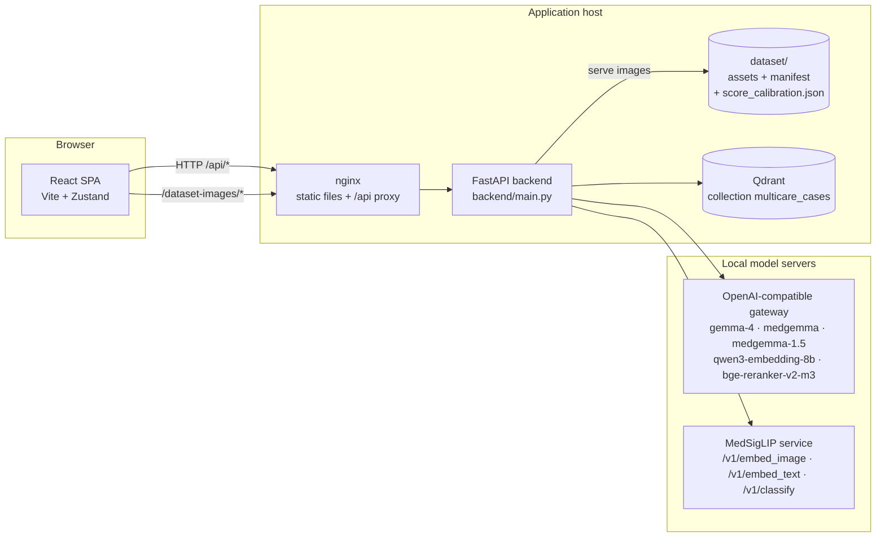
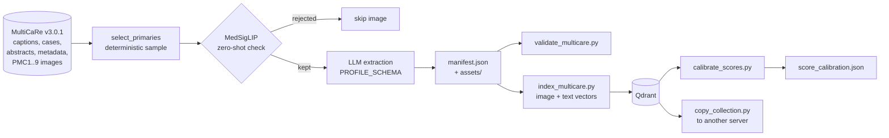
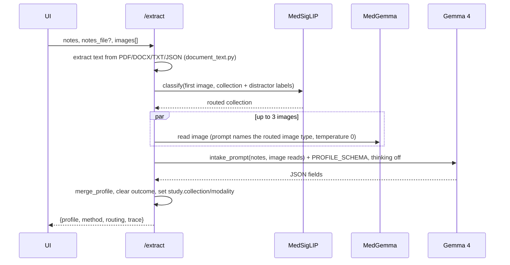
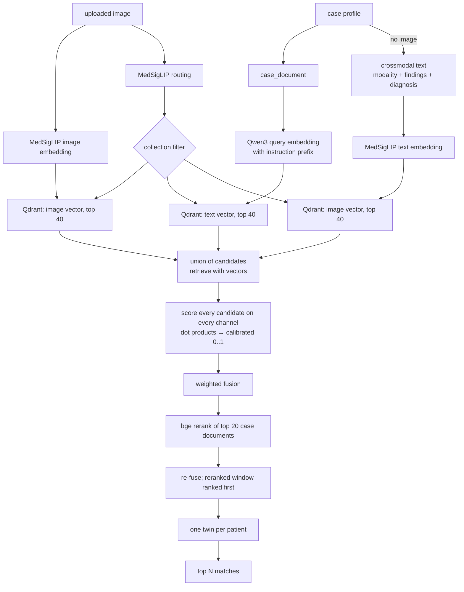

# CaseTwin architecture

This document tells how CaseTwin works from start to end. It gives the
components, the AI models, the data formats, the offline pipeline, the request
flows, the frontend, and the reliability rules. It agrees with the code on the
branch `feature/local-ai-hybrid-twins`.

- [1. What the application does](#1-what-the-application-does)
- [2. System overview](#2-system-overview)
- [3. Deployment topology](#3-deployment-topology)
- [4. AI models and their roles](#4-ai-models-and-their-roles)
- [5. Data model](#5-data-model)
- [6. Offline pipeline: building the twin library](#6-offline-pipeline-building-the-twin-library)
- [7. Online request flows](#7-online-request-flows)
- [8. The AI trace contract](#8-the-ai-trace-contract)
- [9. Frontend architecture](#9-frontend-architecture)
- [10. Reliability and guardrails](#10-reliability-and-guardrails)
- [11. Configuration reference](#11-configuration-reference)
- [12. Repository map](#12-repository-map)
- [13. Testing](#13-testing)
- [14. Known limitations and extension points](#14-known-limitations-and-extension-points)

---

## 1. What the application does

CaseTwin does these three tasks:

1. **Intake.** A clinician types notes or uploads a PDF, DOCX or TXT file. The
   clinician also adds images. The system makes a structured case report.
2. **Twin search.** The system compares the case report and the image with a
   library of published case reports. The most similar cases are the "twins".
3. **Learn from the twin.** Each twin shows its findings, treatment, outcome and
   the conclusion of the authors. The clinician can ask questions about the twin
   and the current case. The clinician can also get an explanation of a medical
   term in English, Hindi or Marathi.

CaseTwin is a demonstration for teaching. It is not a clinical tool. All the
models operate on local servers. The user interface shows each AI step.

---

## 2. System overview



The backend keeps no session data. The browser keeps the case data. The twin
library has two parts:

- Qdrant keeps the vectors and the case profiles.
- The `dataset/` folder keeps the images.

The offline pipeline makes both parts (section 6).

---

## 3. Deployment topology

| Mode | Frontend | Backend | Qdrant |
|---|---|---|---|
| Development | `npm run dev` → `http://localhost:5173`. It calls `VITE_API_URL` (for example `http://localhost:8005`) | `uvicorn main:app --port 8005` in `backend/` | A separate container on `localhost:6333` |
| Docker Compose | nginx on port `8080`. The build sets `VITE_API_URL=/api` | Container port 8000, published as port `8005` | The `qdrant` service on `127.0.0.1:6333`, with the volume `qdrant_storage` |

In Docker Compose, nginx (`nginx.conf`) does these tasks:

- It serves the built single-page application. For an unknown path, it serves
  `index.html`.
- It sends `/api/*` requests to `backend:8000/*` and removes the `/api` prefix.
  Thus, the browser only sends requests to its own origin.
- It sends `/dataset-images/*` requests to the backend. FastAPI makes image URLs
  with the browser `Host` header, so the URLs stay on the same origin.

The backend container mounts `./dataset` at `/app/dataset` as read-only
(`DATASET_DIR`). The secrets come from `backend/.env` through `env_file`. The
container images do not contain secrets.

---

## 4. AI models and their roles

| Model | Server | Use | Code |
|---|---|---|---|
| **MedSigLIP** (`google/medsiglip-448`) | Separate service | Makes image embeddings (1152 dimensions) for visual search. Makes text embeddings in the same space for search with notes only. Gives zero-shot labels to send an image to its collection and to clean the dataset | `local_ai.generate_embedding`, `medsiglip_text_embedding`, `medsiglip_classify` |
| **`medgemma`** (MedGemma 27B) | Gateway | Reads uploaded images during intake. Writes the clinical synthesis. Answers questions about the twin. Explains terms. Reads and compares images for the hidden comparison feature | `query_medgemma`, `query_text`, `query_medgemma_read` |
| **`gemma-4`** | Gateway | Changes notes and image reads into a structured case report with a JSON Schema. Writes explanations again in simple Hindi or Marathi. Extracts library cases offline | `extraction.extract_profile`, `/explain_selection` |
| **`medgemma-1.5`** (4B) | Gateway | Finds bounding boxes of chest X-ray findings. Only the hidden comparison feature uses it | `query_medgemma_localization` |
| **`qwen3-embedding-8b`** | Gateway `/v1/embeddings` | Makes case-report embeddings (4096 dimensions) for semantic search | `local_ai.text_embeddings` |
| **`bge-reranker-v2-m3`** | Gateway `/v1/rerank` | Gives a new score to the top 20 candidate twins (cross-encoder) | `local_ai.rerank` |

All chat calls go through `local_ai.query_local_model`. This function does
these tasks:

- It sends a text-only request as a plain string. MedGemma answers text
  questions directly. The function never sends a placeholder image.
- It sends each image as a base64 PNG data URL. It makes each image smaller
  than 768 pixels on each side.
- It can send a JSON Schema (`response_format: json_schema`). llama.cpp uses the
  schema as a grammar, so the model can only write valid JSON.
- It can send a conversation `history` and a `temperature`.
- It can set `chat_template_kwargs.enable_thinking=false`. This setting stops
  the reasoning step of Gemma 4.
- It can send requests to a different OpenAI-compatible server (`base_url`,
  `api_key`). The offline pipeline uses this option.

You can change the model names (section 11). Other services also use Gemma 4.
Thus, each user action makes only one Gemma 4 call. Batch jobs use 2
concurrent requests by default.

---

## 5. Data model

### 5.1 The canonical case profile

The system uses one JSON structure in all locations: live intake, library cases,
Qdrant payloads, the API and the frontend. `backend/manifest.py::empty_profile`
defines it. `src/lib/caseProfileTypes.ts` has the same structure.

| Section | Fields |
|---|---|
| Identity | `profile_id`, `case_id`, `image_id` |
| `patient` | `age_years`, `sex`, `immunocompromised`, `weight_kg`, `comorbidities[]`, `medications[]`, `allergies` |
| `presentation` | `chief_complaint`, `symptom_duration`, `hpi`, `pmh` |
| `study` | `collection`, `modality`, `body_region`, `view_position`, `radiology_region`, `caption`, `image_type`, `image_subtype`, `image_url`, `storage_path` |
| `assessment` | `diagnosis_primary`, `suspected_primary[]`, `differential[]`, `urgency`, `infectious_concern`, `icu_candidate` |
| `findings` | `imaging_findings[]`, `lab_findings[]`, and the chest sub-objects `lungs`, `pleura`, `cardiomediastinal`, `devices` (yes, no or null) |
| `management` | `treatments[]`, `procedures[]` |
| `summary` | `one_liner`, `key_points[]`, `red_flags[]`, `conclusion` |
| `outcome` | `success`, `detail`, `follow_up` |
| `provenance` | `dataset_name`, `pmc_id`, `pmid`, `doi`, `article_title`, `journal`, `year`, `authors[]`, `license`, `source_url` |
| `tags` | `ml_labels[]`, `gt_labels[]`, `keywords[]`, `mesh_terms[]` |
| `extra_fields` | An open key-value map (for example `ai_image_read`) |

`normalize_profile` does these tasks:

- It adds default values for missing fields.
- It changes a single value into a list when the schema needs a list.
- It keeps all keys in `extra_fields`.

`merge_profile` accepts only the known fields from the model output. Thus, a
model cannot add new keys to the structure.

### 5.2 The extraction schema

`backend/extraction.py::PROFILE_SCHEMA` is the JSON Schema for the LLM. It
contains the clinical sections of the profile. It does not contain the identity,
provenance or tags. These fields come from the dataset. Enums limit the values
of `sex`, `urgency` and the yes/no fields.

The system uses the same schema and the same rules (`_RULES`) for library
articles (`article_prompt`) and for live notes (`intake_prompt`). Thus, the
query and its twins use the same terms.

### 5.3 The case document

`manifest.case_document(profile)` changes a profile into text. The system uses
this text for embedding and reranking. The text contains these items, in this
sequence: demographics, comorbidities, chief complaint, history, imaging,
imaging findings, lab findings, diagnosis, suspected diagnoses, differential,
one-liner and caption. The maximum length is 2,400 characters.

The case document does not contain the outcome or the treatment. A new patient
has no outcome. Thus, the match must use only the presentation and the findings.

### 5.4 Manifest (`dataset/manifest.json`)

The schema version is `multicare-cases/v2`. The manifest has one record for
each library image:

| Field | Meaning |
|---|---|
| `point_id` | A deterministic UUIDv5 of `multicare:<patient>:<file_id>`. It is also the Qdrant point ID |
| `article_id`, `patient_id`, `collection`, `source_file_id` | The source of the record |
| `primary_image` | The asset ID (`<sha256>.<ext>`), caption, licence, type, region, view, labels, size and checksum |
| `related_images[]` | A maximum of 8 other images of the same patient |
| `profile` | The canonical profile |
| `raw_abstract`, `raw_narrative` | The source text |
| `enrichment_status` | `complete` or `unavailable` |
| `extracted_by` | The model that made the profile. This field is internal. The API does not send it |
| `zero_shot` | The result of the MedSigLIP quality check |

The `stats` object records these values: the counts for each collection, the
rejected images, the skipped patients and the sample parameters. You can use
these values to validate or to make the same build again.

### 5.5 Qdrant collection (`multicare_cases`)

- **Named vectors.** `image` has 1152 dimensions (cosine) and comes from
  MedSigLIP. `text` has 4096 dimensions (cosine) and comes from Qwen3. All
  vectors have a length of 1 (L2 normalised). Thus, the cosine is equal to the
  dot product.
- **Payload.** `collection`, `profile`, `primary_asset_id`, `related_asset_ids`,
  `primary_image`, `related_images`, `raw_narrative`, `raw_abstract`,
  `enrichment_status`, `schema_version`.
- **Payload index.** `collection` (keyword). The search uses this index to limit
  results to one collection.

### 5.6 Dataset folder

```
dataset/
├── assets/                    Copies of the images, named by content (<sha256>.<ext>)
├── manifest.json              The library contract (5.4)
├── score_calibration.json     The score range of each channel (6.5)
└── enrichment-cache/          Offline only: the extraction and quality check of each patient
```

`GET /dataset-images/{asset_id}` serves the images. The backend validates each
asset ID. An asset ID cannot contain a path separator. Thus, source paths do not
go out of the backend.

### 5.7 Current library

The library has 648 images from 422 patients and 404 articles:

| Collection | Images |
|---|---|
| Chest X-ray | 163 |
| Chest CT | 132 |
| Dermatology | 67 |
| Fundus | 157 |
| H&E histopathology | 129 |

The pipeline examined 905 sampled images. The quality check rejected 257 images.
The pipeline skipped 144 patients because they had no valid image.

---

## 6. Offline pipeline: building the twin library



### 6.1 Source data

The source is [MultiCaRe](https://github.com/mauro-nievoff/MultiCaRe_Dataset)
v3.0.1 (Zenodo record 20416562). It is in
`medical_datasets/whole_multicare_dataset/`. It has more than 76,000
open-access case reports and more than 139,000 images from PubMed Central.

MultiCaRe uses a model to make the `image_type` and `image_subtype` labels.
Many of these labels are incorrect.

### 6.2 Collections (`backend/collections_config.py`)

| ID | MultiCaRe filter | `zero_shot` label |
|---|---|---|
| `cxr` | radiology / x_ray / thorax | "a chest X-ray radiograph" |
| `chest_ct` | radiology / ct / thorax | "an axial CT scan of the chest" |
| `derm` | medical_photograph / skin_photograph | "a clinical photograph of a skin lesion" |
| `fundus` | ophthalmic_imaging / fundus_photograph | "a color fundus photograph of the retina" |
| `histopath` | pathology / h&e | "an H&E stained histopathology slide" |

`QUALITY_DISTRACTORS` adds eight labels for other image types: charts,
endoscopy, barium fluoroscopy, MRI, ultrasound, intraoperative photographs,
immunohistochemistry and ECG.

### 6.3 `data_pipeline/prepare_multicare.py`

The script does these steps:

1. **Sample.** For each collection, the script sorts the articles by
   `sha256(article_id)`. It takes the first N articles (`--per-collection`).
   You can set a different N for one collection, for example
   `--collection-articles cxr=200`. A larger N always contains the smaller
   sample. Thus, a larger collection uses all the cached results again. The
   script takes a maximum of 2 primary images for each patient
   (`--images-per-patient`).
2. **Check the images first.** MedSigLIP compares each image with the five
   collection labels and the distractor labels. The script keeps an image only
   if the label of its own collection has the highest score. If a patient has no
   kept image, the script skips the patient before the LLM call. The results go
   into `enrichment-cache/quality/`.
3. **Extract.** The script makes one schema-limited LLM call for each patient.
   The input is the abstract and the case narrative of that patient (maximum
   12,000 characters). Thinking is off. The script makes a maximum of 3
   attempts.
   - By default, the script uses Gemma 4 on the gateway.
   - `--extract-model` and `--extract-base-url` send new extractions to a
     different OpenAI-compatible server.
   - The cache key is a hash of `EXTRACTION_VERSION` and the source text.
   - If all attempts fail, the cache records `unavailable`. The script does not
     guess a profile.
4. **Make the records.** The image facts come from the dataset, not from the
   model. These facts are collection, modality, caption, view, region, licence
   and labels. If the model gives no age or sex, the script uses the case data
   of MultiCaRe. The script copies each asset to a temporary file, checks the
   checksum, and then renames the file. Thus, concurrent workers and stopped
   runs cannot damage the assets.
5. **Write** `manifest.json`. The records are sorted. The file contains the
   `stats`.

`--workers` (default 2) sets the maximum number of concurrent LLM requests.
`--extract-only` fills the cache and does not copy images.

### 6.4 `backend/index_multicare.py`

For each record that is not in the collection, the script does these steps:

1. It makes a Qwen3 embedding of `case_document(profile)`. It sends one text in
   each request (see 10.4).
2. It makes a MedSigLIP embedding of the primary image.
3. It writes a point with the two named vectors and the payload.

The script makes the collection and the `collection` payload index on the first
write. It reads the vector sizes from the first real embeddings. If an embedding
fails, the script tries that record again in a later pass. It does a maximum of
3 passes. Thus, a temporary server fault does not stop the run. The script skips
the point IDs that are already in the collection.

### 6.5 `backend/calibrate_scores.py`

Each signal has a different scale. These are the ranges on the current library:

| Channel | Typical range (5th to 95th percentile of the top-10 scores) |
|---|---|
| `image` (MedSigLIP cosine) | 0.60 to 0.87 |
| `text` (Qwen3 cosine) | 0.46 to 0.69 |
| `crossmodal` (MedSigLIP text-to-image cosine) | 0.12 to 0.39 |
| `rerank` (bge logit) | −6.4 to +0.6 |

The script does these steps:

1. It selects 60 cases from the library.
2. It searches the library with each case. It ignores results from the same
   patient.
3. It writes the ranges to `dataset/score_calibration.json`.

The search changes each raw score with `clip((raw − lo) / (hi − lo), 0, 1)`.
After this change, 0 is a typical weak twin and 1 is a typical strong twin, for
each channel.

### 6.6 `backend/validate_multicare.py` and `backend/copy_collection.py`

- **Validation.** The script checks these items: unique point IDs, profile
  identity, collection and type agreement, asset files and checksums. With
  `--source`, it makes the sample again and compares the counts.
- **Collection copy.** The script copies points, with their vectors and
  payloads, from one Qdrant server to another through the API. It operates
  across Qdrant versions. It does not make new embeddings. You can run it again
  safely.

---

## 7. Online request flows

All endpoints are in `backend/main.py`. The request bodies use multipart form
data. Each AI endpoint sends a `trace` in the response (section 8).

### 7.1 `POST /extract`: notes and images to a case report



- **Image read prompt.** The prompt tells MedGemma the image type, for example
  "This image is a clinical photograph of a skin lesion". With a general
  prompt, MedGemma described bone X-ray findings for a skin photograph.
- **Intake rules** (`_RULES` and `_INTAKE_RULES`):
  - The model uses only the facts in the source.
  - An uncertain diagnosis ("?TB", "likely", "vs") goes into
    `suspected_primary`. It does not go into `diagnosis_primary`.
  - Each red flag must include its value. These are the red flags:
    - SpO2 < 92%, RR > 24, HR > 120, systolic BP < 90
    - Altered consciousness
    - Haemoptysis, weight loss, sepsis
    - An acute haemoglobin decrease or bleeding
  - The red flags set the urgency.
  - If the notes and the AI image read do not agree, the model writes this red
    flag: "Discrepancy: notes say X; AI image read says Y. Verify."
- **Outcome.** The system always clears the outcome of a new case. The image
  reads go into `extra_fields.ai_image_read`.
- **Fallback.** If Gemma 4 fails, a regex extractor operates. The response then
  has `method: regex-fallback`, and the user interface shows a warning. The
  frontend never makes a profile by itself.

### 7.2 `POST /search`: hybrid twin search

The inputs are an optional `file` (JPEG, PNG or WebP), an optional `profile`
(JSON), `collection` (default `auto`) and `limit` (default 10). The request
must have an image or a case document of 20 or more characters.



**Routing.** MedSigLIP compares the image with the collection labels and the
distractor labels. The best collection label wins, but not if a distractor score
is more than `ROUTING_MARGIN` (1.5) times larger. Thus, when the scores are
almost equal, the image goes to the collection. For example, a real chest X-ray
can get a score that is almost equal to "fluoroscopy". When a distractor wins
clearly, the search uses all collections. Without an image, the search uses no
filter.

**Fusion weights** (`qdrant_service.weights_for`):

| Inputs | Weights |
|---|---|
| Image and case report | image 0.5, text 0.3, rerank 0.2 |
| Image only | image 1.0 |
| Case report only | crossmodal 0.15, text 0.55, rerank 0.3 |

Each channel finds its candidates. The search then gives each candidate a score
on all available channels, with the stored vectors. The final score is
`Σ weight × calibrated(channel)`. The user interface shows it as a percentage.
The candidates outside the reranked top 20 stay below the reranked candidates.

**Response.** Each match contains these fields:

- `id`, `score`, `scores` (calibrated, for each channel), `raw_scores`, `weights`
- `collection`, `modality`, `diagnosis`, `summary`, `conclusion`, `treatments`,
  `imaging_findings`, `outcome`, `outcomeVariant`
- Demographics and provenance (PMC ID, title, journal, year, licence, source URL)
- `image_url`, `related_image_urls`, `case_text`
- `raw_payload`: the full profile with the image URLs

The response also contains `collection`, `routing` (top labels and scores) and
`trace`.

If the cross-modal step fails, the search continues with the case-report text.
The trace records this skip.

### 7.3 `POST /chat_twin`: grounded questions and answers

MedGemma (text only) gets these inputs:

- The twin profile, from `_profile_context(include_outcome=True)`.
  This text contains demographics, history, findings, diagnosis, treatment,
  outcome, follow-up and conclusion. It also contains a maximum of 900
  characters of the narrative.
- The current case, without the outcome fields.
- A maximum of 6 earlier turns as chat history. Each turn has a maximum of 1,200
  characters.

The prompt limits the answer to the two summaries and to 120 words. The answer
must not give a definite treatment order for the current patient.
`_clean_reply` removes repeated prompt text and repeated lines. If the call
fails, the endpoint sends HTTP 502 with the reason.

### 7.4 `POST /explain_selection`: term explanations

| `language` | Model chain |
|---|---|
| `en` and `audience=clinician` | MedGemma writes 1 to 3 sentences for a clinical reader |
| `en` and `audience=patient` | MedGemma writes the explanation in plain English |
| `hi` or `mr` | MedGemma writes plain English, for medical accuracy. Then Gemma 4 writes it again in simple Hindi or Marathi, in Devanagari script. Gemma 4 keeps the English term in brackets and adds no facts. Thinking is off. The temperature is 0.2 |

The response contains `explanation`, `explanation_en` (for Hindi and Marathi)
and `language`.

### 7.5 `POST /enhance_profile`: clinical synthesis

The endpoint makes two MedGemma calls at the same time:

- **Synthesis.** A text-only call with `_profile_context`. It writes 3 or 4
  points about differentials, risk factors, red flags and missing data.
- **Imaging context.** This call occurs only if the request has an image. It
  writes 2 or 3 sentences about the image in the context of the case.

The endpoint does not change the profile. It has no effect on the match.

### 7.6 `POST /compare_insights`: image comparison (hidden in the UI)

The endpoint operates, and the tests check it. But the button is a comment in
`DashboardPage.tsx`. MedGemma reads of journal figures were not sufficiently
reliable. The endpoint does these steps:

1. **Independent reads.** MedGemma 27B reads each image in a separate call, at
   the same time. Thus, the second read cannot copy the first read. A chest
   X-ray read must not give the left or right side. The model often gives the
   side as the viewer sees it, not the side of the patient.
2. **Text comparison.** A text-only MedGemma call compares the two reads.
3. **Guardrails.**
   - If the text says progression, resolution or outcome, the endpoint sends
     HTTP 502 "needs review".
   - The twin caption can report a finding (pneumothorax, pleural effusion or
     mediastinal gas). If the historical read does not confirm that finding,
     the result is "inconclusive".
4. **Chest X-ray boxes.** A JSON-schema text call gets the finding names from
   the reads. MedGemma 1.5 finds a box for a finding only if its read gives the
   finding as present. The box uses the MedGemma format `[y0, x0, y1, x1]` on a
   0 to 1000 scale. The box must have a matching label.

### 7.7 Other endpoints

| Endpoint | Purpose |
|---|---|
| `GET /health` | Shows that the backend operates |
| `GET /ai_status` | Shows the role and status of each model (gateway `/models` and MedSigLIP `/health`). Also shows the library collection and its point count |
| `GET /collections` | Shows the collection IDs, labels and modalities |
| `GET /dataset-images/{asset_id}` | Serves a library image |
| `POST /search_hospitals`, `POST /analyze_hospital_page` | **Legacy.** These are for the Route and Memo features (external web search and an LLM page summary). The UI hides these steps. They are not part of the local-model flow |

---

## 8. The AI trace contract

Each AI endpoint sends `trace: [{model, task, ms, output?}]`. The steps are in
the sequence of execution. `output` contains important intermediate text, for
example the MedGemma image reads during intake.

The frontend adds each trace to a session log (`aiTrace` in the store). The log
keeps the last 40 entries. The **AI pipeline** drawer shows the log. The matches
screen also shows the search trace. A skipped or rejected step has a task that
tells why, for example "Cross-modal search skipped" or "guardrail".

---

## 9. Frontend architecture

The frontend uses React 18, TypeScript, Vite, Tailwind, Zustand, react-router,
react-markdown and sonner (for toast messages).

### 9.1 Routes and screens

| Route | Screen |
|---|---|
| `/` | `DashboardPage`. A wizard with two steps: **Upload** (case profile and copilot) and **Matches** |
| `/about` | `AboutPage`. "How it works": the pipeline and the AI concept of each step |
| `/chat` | `ChatModelsPage`. Open WebUI in an iframe (`VITE_OPENWEBUI_URL`) |

The Route and Memo steps are still in `DashboardPage`. But the user cannot get
to them, because they are comments.

### 9.2 Key components

| Component | Function |
|---|---|
| `AgenticCopilotPanel` | The intake chat: file drop, notes, status line, chips for captured fields, completeness |
| `CaseProfileView` | Shows the profile and the **Enhance Profile** button. Contains the explain popover |
| `MatchesScreen` (in `DashboardPage`) | Shows the twin list, "How these twins were found", the twin detail, "What happened in the twin case" and the comparison matrix |
| `MatchCard` (in `DashboardPage`) | Shows the score ring, the conclusion and outcome, and `ScoreBreakdown` for each channel (calibrated value; the tooltip shows the raw score) |
| `TwinProfileModal` | Shows the full twin profile: history, outcome, treatment, conclusion, findings and images |
| `TwinChatPanel` | Ask Copilot. Sends the twin profile, the current profile and the chat history to `/chat_twin` |
| `SelectionExplainPopover` | The user selects text and clicks Explain, Simple, हिंदी or मराठी |
| `AiPipelinePanel` | Shows the model status (`/ai_status`) and the session trace |

### 9.3 State (`src/store/dashboardStore.ts`)

One Zustand store keeps all the data that must stay when the user changes tabs
or pages. The store is in memory. Thus, a page reload starts a new session.

| Field | Content |
|---|---|
| `profile` | The current case profile |
| `orchestratorState` | Copilot messages, phase, `notesSoFar`, `currentQuestion` and `answeredFields` |
| `step` | The wizard step |
| `uploadedFile` | The case image |
| `matchResults`, `searchMeta`, `selectedMatch`, `isSearching`, `searchError`, `lastSearchKey` | The twin search state |
| `enhancedSynthesis`, `enhancedImaging` | The Enhance Profile output |
| `aiTrace` | The session AI log |

### 9.4 Intake orchestration (`src/lib/agenticOrchestrator.ts`)

When the user sends a message, the orchestrator does these steps:

1. It adds the new text to `notesSoFar`. Thus, Gemma 4 always gets the full
   record. A short answer, for example "he smokes", keeps its context.
2. It calls `/extract` with all the notes and the new images.
3. It merges the result into the current profile
   (`caseProfileUtils.mergeProfiles`). A filled value replaces the old value. An
   empty value keeps the old value.
4. It compares the fields and shows "captured" chips. It calculates the
   completeness with `computeProfileConfidence` (14 fields; the profile is ready
   at 60%). A suspected diagnosis counts as a diagnosis.
5. It asks a follow-up question from a fixed checklist (`agenticCopilot.ts`).
   The question is about the first empty field that the clinician did not
   already answer.

**Answered fields.** An answer such as "no comorbidities" gives an empty field.
Thus, the field stays empty after the answer. The orchestrator records the field
of each question in `currentQuestion`. If the clinician replies and that field
is still empty, the orchestrator adds the field to `answeredFields`. The
checklist does not ask about a field in `answeredFields` again. The
diagnosis question does not occur when `suspected_primary` has a value.

If an error occurs, the chat shows it, and the orchestrator keeps the previous
profile.

### 9.5 Search triggering

When the user opens **Matches**, the frontend starts a search only if the case
changed. It compares `searchKey(profile, file)` with `lastSearchKey`. The key
contains the profile (without the blob image URL) and the name, size and change
time of the file. **Re-run search** always starts a search. The image is
optional. Without an image, the backend searches with the notes only.

### 9.6 API client (`src/lib/twinApi.ts`)

The client has these functions: `searchTwins`, `compareInsights`,
`fetchAiStatus` and the legacy `findHospitalsRoute`. It also has the shared
types: `MatchItem`, `SearchResult`, `AiTraceStep`, `ChannelScores` and
`RoutingScore`. `normalizeMatchPayload` changes single values into lists where
the UI needs lists. The base URL is `VITE_API_URL` (`src/lib/api.ts`).

---

## 10. Reliability and guardrails

### 10.1 Grounding and honesty

- Extraction uses only the facts in the source. A missing fact is `null`, not
  "no".
- The JSON Schema limits the output. The model can only write the agreed fields.
- Twin chat and explanations use only the given context. The Hindi and Marathi
  text must not add facts.
- The system shows each disagreement between the notes and the image read as a
  red flag. It does not hide the disagreement.
- The system has no silent fallbacks. The regex extractor has a label, and the
  UI shows each error.

### 10.2 Determinism

- The library sample uses a hash order. The point IDs are UUIDv5. The manifest
  is sorted.
- Intake image reads and comparison calls use temperature 0. Thus, a demo gives
  the same result each time.

### 10.3 Image-model limits

- On published figures, MedGemma often gives the wrong side (left or right) and
  does not see small findings. Thus, the comparison UI is hidden, and chest
  X-ray reads do not give a side.
- Many MultiCaRe image-type labels are incorrect. MedSigLIP removes these images
  from the library.

### 10.4 Embedding server behaviour

- With continuous batching, a llama.cpp embedding server sent vectors of NaN
  values when two or more texts were in one batch.
  - `text_embeddings` sends one text in each request.
  - It checks each vector (finite values, not zero).
  - If a vector is bad, it tries again after a longer delay each time. It sends
    a small unrelated request before each attempt.
  - The indexer tries failed records again in later passes.
  - To remove the cause, start the server with `--no-cont-batching`, or use a
    newer llama.cpp.
- The MedSigLIP text encoder accepts a maximum of 64 tokens. For longer text, it
  sends HTTP 500. `medsiglip_text_embedding` makes the text shorter: first 180,
  then 110, then 60 characters. It cuts the text between words.

### 10.5 Shared-service rules

- By default, batch work sends a maximum of 2 concurrent requests to Gemma 4.
- Each user action makes one Gemma 4 call, with thinking off.

---

## 11. Configuration reference

### Backend (`backend/.env`, template `backend/.env.example`)

| Variable | Default | Purpose |
|---|---|---|
| `LOCAL_GATEWAY_BASE_URL`, `LOCAL_GATEWAY_API_KEY` | — | The OpenAI-compatible gateway. The code adds `/v1` if it is missing |
| `GEMMA_MODEL` | `gemma-4` | Case report and Hindi/Marathi text |
| `MEDGEMMA_MODEL` | `medgemma` | Image reads, chat, synthesis and explanations |
| `MEDGEMMA_COMPARISON_MODEL` | `medgemma` | Comparison reads |
| `MEDGEMMA_LOCALIZATION_MODEL` | `medgemma-1.5` | Chest X-ray boxes |
| `TEXT_EMBEDDING_MODEL` | `qwen3-embedding-8b` | Case-report embeddings |
| `RERANK_MODEL` | `bge-reranker-v2-m3` | Reranking |
| `MEDSIGLIP_BASE_URL`, `MEDSIGLIP_API_KEY` | — | The MedSigLIP service |
| `QDRANT_URL`, `QDRANT_API_KEY` | `http://localhost:6333`, none | The vector store |
| `COLLECTION_NAME` | `multicare_cases` | The twin collection |
| `DATASET_DIR` | `<repo>/dataset` (if empty) | Images, manifest and calibration |
| `ALLOWED_ORIGINS` | — | More CORS origins. The code already accepts the localhost development origins |
| `PREPARE_WORKERS`, `PREPARE_EXTRACT_MODEL`, `PREPARE_EXTRACT_BASE_URL` | 2, —, — | Defaults for the offline pipeline |
| `YDC_API_KEY`, `GEMINI_API_KEY`, `LOCAL_LLM_*` | — | Only for the legacy Route and Memo code |

### Frontend (`.env`, template `.env.example`)

| Variable | Purpose |
|---|---|
| `VITE_API_URL` | The backend base URL. Use `http://localhost:8005` in development. Docker builds use `/api` |
| `VITE_OPENWEBUI_URL` | The target of the Chat tab iframe (optional) |

---

## 12. Repository map

```
├── ARCHITECTURE.md              This document
├── README.md                    Setup, run and deployment
├── docker-compose.yml           qdrant, backend and frontend
├── Dockerfile, nginx.conf       Frontend image (built with VITE_API_URL=/api) and proxy
├── backend/
│   ├── main.py                  FastAPI application and all endpoints
│   ├── local_ai.py              Clients: gateway chat, embeddings, rerank; MedSigLIP
│   ├── extraction.py            PROFILE_SCHEMA, prompts, schema-limited extraction
│   ├── qdrant_service.py        Hybrid search, calibration, fusion, one twin per patient
│   ├── manifest.py              Canonical profile, normalisation, case_document, paths
│   ├── collections_config.py    Collections, zero-shot labels and distractor labels
│   ├── document_text.py         Text from PDF, DOCX, TXT and JSON notes
│   ├── index_multicare.py       Manifest to Qdrant (named vectors, retries in later passes)
│   ├── calibrate_scores.py      Leave-one-out score ranges
│   ├── validate_multicare.py    Manifest checks
│   ├── copy_collection.py       Qdrant-to-Qdrant copy without new embeddings
│   ├── embedding_service.py     Re-exports for compatibility
│   ├── agents.py                Legacy hospital-page summary (Route step)
│   ├── llm_service.py           Legacy; not used
│   ├── preflight_local_models.py  Quick check of the gateway and MedSigLIP
│   └── test_*.py                pytest suites
├── data_pipeline/
│   └── prepare_multicare.py     Sample, quality check, extraction, manifest
├── demo_samples/                Seven demo cases and the facilitator guide
├── medsiglip_inference_endpoint/  Legacy Hugging Face endpoint handler (the application does not use it)
└── src/
    ├── pages/                   DashboardPage, AboutPage, ChatModelsPage
    ├── components/              Copilot, profile, twin modal and chat, explain popover, AI pipeline, ui/
    ├── lib/                     twinApi, caseProfileTypes/Utils, agenticOrchestrator, agenticCopilot, api
    └── store/dashboardStore.ts  Application state
```

Git ignores these items: `medical_datasets/` (source), `dataset/` (the built
library), the `.env` files, the virtual environments and the build output.

---

## 13. Testing

- **Backend.** Run `cd backend && .venv/bin/python -m pytest -q`. The 38 tests
  check these areas:
  - Extraction: the schema, thinking off, the fallback label and the empty
    outcome.
  - Text-only requests and requests with history.
  - Manifest normalisation and `case_document`.
  - Search: fusion, calibration, routing when scores are almost equal, the
    cross-modal fallback, and shorter MedSigLIP text.
  - The Hindi and Marathi model chain.
  - Comparison: independent reads, guardrails, box conditions, removal of
    introductory text, and errors.

  The tests use mock objects for all model calls.
- **Frontend.** Run `npx tsc -b` and `npx vite build`.
- **End to end.** The cases in `demo_samples/` test the full pipeline with the
  live models. Their README gives the expected twins.

---

## 14. Known limitations and extension points

**Limitations**

- The library has 648 images. For a rare diagnosis, the search finds cases that
  look similar, but not cases with the same diagnosis.
- On journal figures, MedGemma image reads often give the wrong side and do not
  see some findings.
- The copilot follow-up questions come from a fixed checklist, not from a model.
- More than one LLM made the library profiles. All of them used the same schema
  and rules.

**Extension points**

- **Add a collection.** Add an entry to `COLLECTIONS` (filter, modality and
  zero-shot label). Then run `prepare_multicare.py`, `index_multicare.py` and
  `calibrate_scores.py`. The pipeline uses the cached work again.
- **Make the library larger.** Increase `--per-collection` or
  `--collection-articles`. The hash order keeps the current cases and caches
  valid.
- **Change a model.** Change the model variable in `backend/.env`. The code
  reads the vector sizes from the first embedding. If you change an embedding
  model, you must index and calibrate the library again.
- **Show the image comparison again.** Remove the comment marks from the button
  block in `DashboardPage.tsx`.
- **Move to a different server.** Copy `dataset/` with `rsync` and run
  `copy_collection.py`. The README section "Deploying to a server" gives the
  steps.
